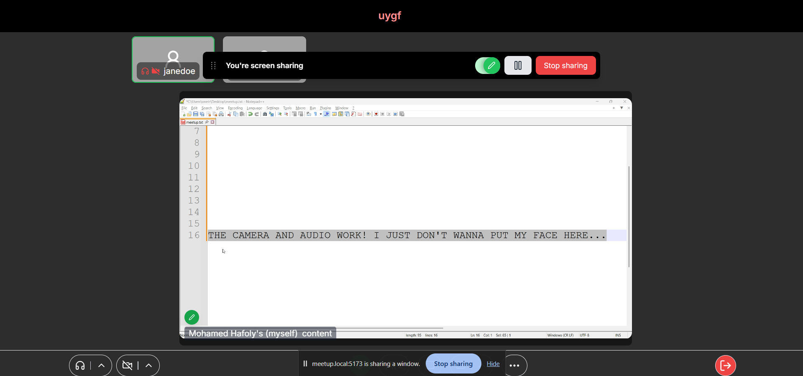
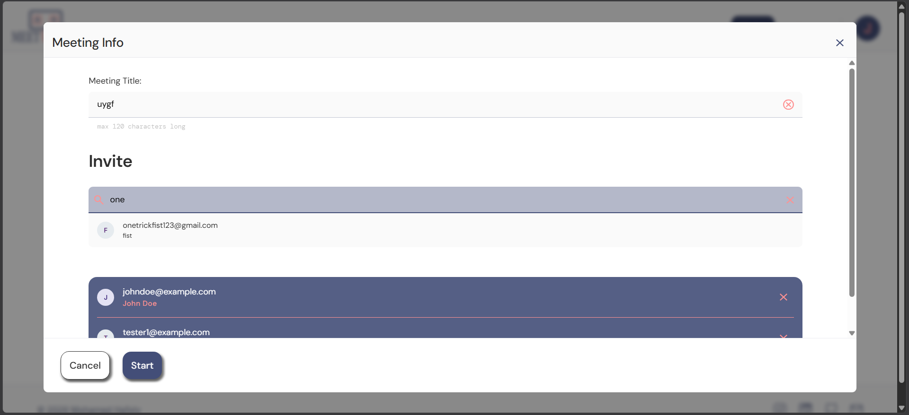
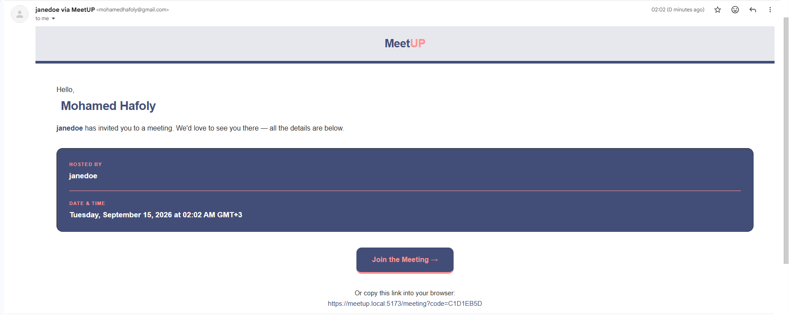
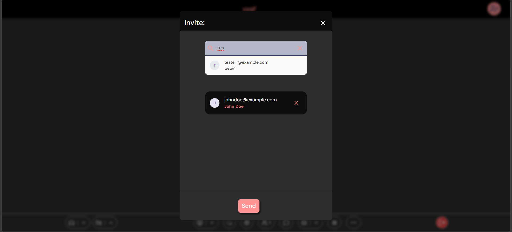
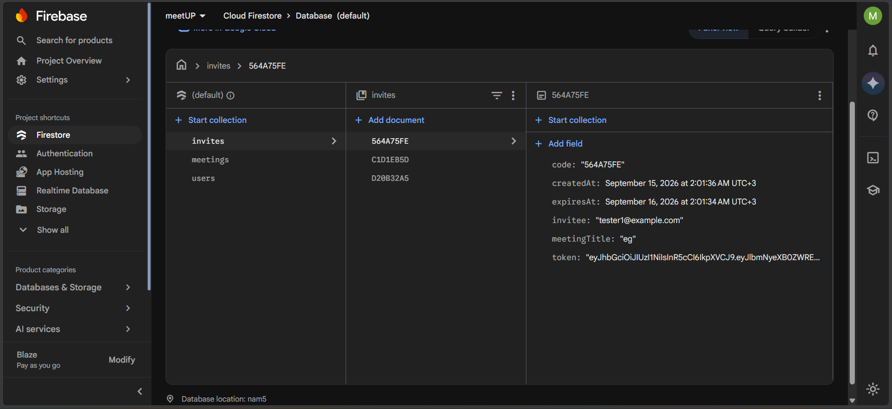
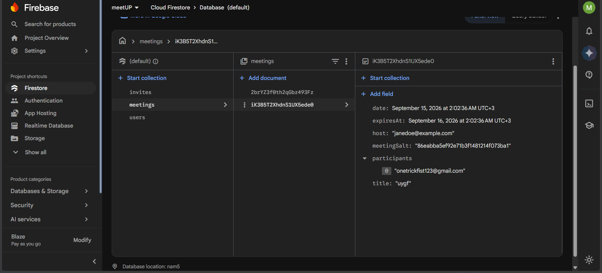

# Meetup

A video meeting app. Create a meeting, invite people by name, and everyone joins from a link in
their inbox — with video, audio and screen sharing in the browser.

Built from scratch: React front end, Node API, real-time video through the Zoom Video SDK.

**React 19 · TypeScript · Node · Express · Firebase · Redis · Zoom Video SDK**



## Accounts and sign-in

Sign-up and sign-in run through Firebase Authentication, so passwords are never handled by this
app directly. Once you're in, your session lives on the server in Redis rather than in the browser
— which means signing out takes effect immediately and everywhere, instead of waiting for a token
to expire.

## What it does

**Start a meeting and invite people.** Search the people you know by name or email and add them to
the call. Everyone selected gets an email invitation.



**Invitations arrive as a personal link.**



**Add more people once you're live.** Invitations work the same way mid-call as they do up front.



## The interesting part: invitations that can't be forwarded

Plenty of apps send invite links that work for whoever holds them — forward one, paste it in a
group chat, and a stranger walks into your meeting. The apps that prevent this usually check you
at the door: you arrive, they look up whether your account is on the guest list, and they let you
in or turn you away.

This app has no guest list to check. Every invitation is **encrypted specifically for the person it
was sent to**, and the link itself contains no meeting information — just a short code. When
someone opens it, the server tries to decrypt the invitation using *their* account. The right
person's account unlocks it. A stranger's doesn't, so there's nothing to let them into.

You can see it in the database. This is a stored invitation:



A code, who it was for, when it expires, and an encrypted blob. The meeting it opens isn't in
there — so even someone with full access to the database can't tell which meeting an invitation
belongs to.

And the meeting record itself:



The long random string is the value the encryption is built on — stored in plain sight, because on
its own it unlocks nothing.

The encryption is AES-256-GCM, with a key derived from the recipient's account id and a random
value unique to each meeting. No password is involved, and no line of code anywhere asks "is this
the right person?" — a forwarded link simply produces the wrong key and fails to decrypt.

## Other things worth mentioning

- **Video credentials never reach the browser.** Access tokens for the video service are signed on
  the server, and whether you're a host or a guest is decided there too — so a guest can't promote
  themselves.
- **Fully typed front end** with React Router data loading, and 29 tests covering the data and
  form-handling layers.

## Running it locally

Needs Node 20+, Redis, a Firebase project, and Zoom Video SDK credentials. The front end and API
install separately:

```bash
cd server && npm install && npm run dev
```

```bash
cd client && npm install && npm run dev
```

Both run over HTTPS locally (the session cookie requires it), so you'll need a local certificate
via [mkcert](https://github.com/FiloSottile/mkcert) and a `meetup.local` entry in your hosts file.
Create a `.env` in each folder with your own Firebase, Redis and Zoom credentials.

Then open **https://meetup.local:5173**.
